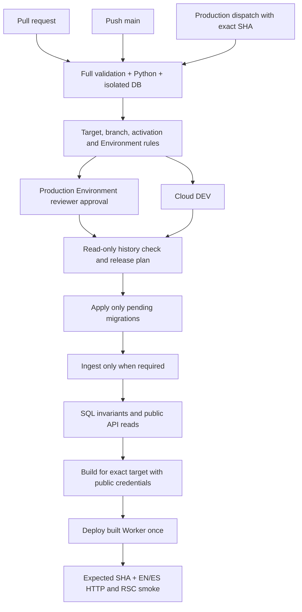

# CI/CD audit and activation runbook

Status: implemented for review; remote activation and production release are not approved by this change.

## Audited starting point

Audited on 2026-09-15/16 (Madrid) against `Xarli11/PokeStudio`:

| Area                     | Evidence                                                                                                   |
| ------------------------ | ---------------------------------------------------------------------------------------------------------- |
| Checkout and GitHub main | `1a09413776611d602a72b5e3d5895cd1db1ccf38`, clean checkout                                                 |
| Workflows                | Only `.github/workflows/ci.yml`, active; Node and Python lanes                                             |
| GitHub Environments      | API returned no environments                                                                               |
| Main protection          | Classic protection returned 404; effective branch rules API returned `[]`                                  |
| Worker                   | `pokestudio`, from tracked Wrangler config; previous release report records Workers Builds Git integration |
| Cloud DEV                | Approved ref `tofhupgwxsexrburoqys`; prior release report records canonical migrations and full ingestion  |
| Production               | No approved project ref, Worker or origin in the repository                                                |

The prior release's database counts and Cloudflare state are historical evidence, not a fresh remote database audit. This implementation session did not migrate, ingest, deploy, create Environments or alter remote settings. Existing Cloudflare build triggers were not changed or independently authenticated in this audit.

The implementation lives on `ci/guarded-delivery` in an isolated checkout based on the exact release commit. The original development checkout and the synced project references remain untouched.

## Workflow design

- `ci.yml` is reused by both release workflows. PRs receive no Environment secrets and do not use `pull_request_target`. Forks use GitHub-hosted runners, not the Pi. The mandatory Node gate is `pnpm validate:full`, including `pnpm test:ci`; Python retains its existing checks. The separate DB job creates, migrates, tests and destroys a disposable Supabase instance on the runner. It runs persistence and advisory-lock tests, not the full 35-minute upstream ingestion.
- `cloud-dev.yml` runs on main or manual recovery. `production.yml` runs only on manual dispatch. Both use `release.yml` and repository commands. All action dependencies are pinned to commit SHAs; pnpm comes from `packageManager`, Node from `.nvmrc`, and installation uses the lockfile.
- Delivery concurrency is a fixed group per environment with `cancel-in-progress: false`, including validation, approval wait, database preparation, build, deploy and smoke. Only PR validation is cancellable. GitHub's pending queue is not FIFO: a newer run can replace a pending run. No release decision depends on `github.event.before`.
- The same existing Postgres advisory lock protects every ingester, including manual Pi/DEV invocations. Database URLs must use direct or session-pooled connections on port 5432, with TLS; transaction pooling on 6543 cannot preserve a session lock. GitHub concurrency does not replace this database lock.
- Production dispatch requires current main's full SHA, `production:<SHA>`, successful Cloud DEV delivery of that exact SHA, an explicitly configured production target, and real Environment approval. GitHub rules are checked before the approval job and again afterward. After the gate, the approval-history API must prove a configured individual reviewer approved this exact run; neither the original requester nor the rerun actor may approve. Production recovery requires a fresh dispatch, because approval history is not attempt-scoped; stale main is checked again before deploy. No arbitrary ref is checked out with privileged secrets.

## Sources of truth and ingestion decisions

`scripts/ci/targets.json` is the reviewed target allowlist. DEV is fixed to the released target; production is deliberately `null`. To activate production later, review a separate change with its exact, distinct `projectRef`, `worker`, and canonical HTTPS `workers.dev` URL. Provision that Worker and Supabase project under a separately approved operation first. Custom domains need a reviewed routing extension; this implementation does not invent production DNS.

Release calls `db:cloud-dev:check`, `db:cloud-dev:migrate`, `ingest:cloud-dev`, `build:cf`, `deploy:cf:built` and `smoke:cloud-dev`. Production wrappers share the same upstream ingestion, advisory lock, Supabase CLI and smoke engine without weakening the Pi or DEV guards. The existing `deploy:cf` command retains its local build-and-deploy behavior. `deploy:cf:built` publishes the artifact just built, without a second build.

The baseline is the last successful **whole delivery workflow** for that environment. The first DEV run uses the audited Milestone 2 commit; first production has no baseline and requires ingestion. Missing/unreadable API history, non-ancestor baselines, aliases, gaps or unknown migration versions fail closed. Historical migration edits/deletions are rejected. Runtime migration planning compares local filenames with actual remote history and accepts only a canonical prefix. CI does not repair aliases automatically.

Automatic ingestion is required for pending migrations, importer source/script changes, ingestion wrapper changes, the importer's package manifest, or any lockfile change (conservative dependency handling). Frontend, documentation and test-only changes skip it. Migration changes are conservatively treated as requiring a refresh even when they only change an index. Manual `force_ingest` handles upstream changes without a code change. There is no unsafe “skip required ingestion” switch.

Readiness checks require 25 natures, at least 175 held items, at least 693197 learnsets, at least 1025 species, exactly one default form per species, and representative species. These floors come from the Milestone 2 baseline and are reviewed when data policy changes. Public API reads prove the actual publishable key and RLS path work; SQL by itself bypasses that boundary. New Supabase projects may need explicit public-read table grants: failures stop deployment instead of adding grants silently.

## GitHub configuration — not applied by this patch

Create the environments **before** enabling delivery. Both must use “Selected branches and tags” with exactly one rule: branch `main` (no tag or wildcard). In `production`, configure individual users as required reviewers (team-only approval is deliberately unsupported), prevent self-review, and disallow admin bypass. A second eligible reviewer is needed when the requester cannot self-approve. If the repository plan cannot enforce these rules, production stays disabled; a dispatch input is not a substitute for Environment protection.

Use the same secret names in each Environment with **different values**:

| Scope                | Name                       | Purpose                                                                                                                 |
| -------------------- | -------------------------- | ----------------------------------------------------------------------------------------------------------------------- |
| Environment secret   | `SUPABASE_DB_URL`          | Target-matched PostgreSQL URL; direct/session 5432 and `sslmode=require` or `verify-full`                               |
| Environment secret   | `SUPABASE_INGEST_KEY`      | Target's privileged ingestion credential; never configured on web Worker                                                |
| Environment secret   | `SUPABASE_PUBLISHABLE_KEY` | Target's public publishable key, or matching legacy anon JWT                                                            |
| Environment secret   | `CLOUDFLARE_API_TOKEN`     | Token scoped to the appropriate account with Workers Scripts edit, Workers CI read and required account/subdomain reads |
| Environment variable | `CLOUDFLARE_ACCOUNT_ID`    | Account ID; API audit verifies its subdomain matches the approved Worker origin                                         |
| Environment variable | `CLOUDFLARE_DEPLOY_OWNER`  | `github-actions`, set only after the ownership cutover below                                                            |
| Repository variable  | `CLOUD_DEV_CD_ENABLED`     | Keep absent/false until DEV activation is approved; then `true`                                                         |
| Repository variable  | `PRODUCTION_CD_ENABLED`    | Keep absent/false until separate production setup and approval; then `true`                                             |

Do not duplicate privileged secrets at repository or organization scope. Release secrets are injected only into the delivery step, after checkout/install. Child builds receive an allowlist of ordinary environment variables plus the public database values. The generated Wrangler file contains public bindings and release identity only and is deleted afterward. A Worker audit rejects known privileged Supabase bindings. No `.env.local` is sourced when `CI=true`.

Protect main with a PR requirement, review requirements, the stable `CI required` status check, up-to-date checks, no force pushes/deletions, and no bypass for routine changes. Set workflow permissions to read-only. Require owner review of `.github/`, `scripts/ci/`, target configuration and migrations using CODEOWNERS/branch rules appropriate to the actual reviewer team. This patch does not invent reviewer identities. GitHub admin/rules changes are outside what repository YAML can enforce.

## Activation and Cloudflare handover

1. Review this patch and run PR CI. Keep both activation variables false. A disabled delivery deliberately fails with an explicit message; it must not create a false successful baseline.
2. Freeze merges briefly. In Cloudflare, disconnect/remove the Git build deployment trigger for `pokestudio`, cancel/drain pending builds and confirm no deployment is active. Disable any alternate deploy hook for the same Worker. Do this **before merging** the workflow change: the old integration otherwise deploys main without waiting for Actions.
3. Configure `cloud-dev` and its values. Confirm the deployed Milestone 2 schema/data are intact. Set `CLOUDFLARE_DEPLOY_OWNER=github-actions`, enable DEV, then merge. Actions becomes the sole deployment owner.
4. Observe the first real delivery: no new migrations and no ingester changes should mean no new ingestion. Require one Worker deployment, the expected SHA on `/api/health`, two clean smoke rounds and the workflow summary. Correct any environment/API permission problems without bypassing guards.
5. Only after an explicitly approved production setup: review its target, backup/restore readiness and compatibility plan, provision its isolated resources, configure reviewers/secrets and enable production. Dispatch from main with the successfully delivered DEV SHA and matching confirmation. The Environment reviewer approves that specific run and its `force_ingest` input.

`CLOUDFLARE_DEPLOY_OWNER` records the reviewed handover. The pipeline additionally resolves the Worker's immutable tag and requires the Cloudflare Builds API to return an empty trigger list, both before DB preparation and before deployment. Missing permissions, unknown responses or remaining triggers block the run. A separate actor could still deploy directly or reconnect a trigger after the check; drain builds during handover and restrict dashboard access. No script can lock out an account administrator.

## Failure handling and rollback

- Any preparation or integrity failure stops before web deployment. A failed delivery does not advance the baseline, so subsequent catch-up runs retain pending data changes.
- Database writes are not globally atomic. A crashed batch replacement can leave incomplete relations visible to the currently running Worker. Do not cancel a delivery during writes. For DEV, rerun the failed run, retaining `force_ingest` if set. For production, create a fresh dispatch and obtain a new approval; rerunning an existing production run is rejected. After a failed manual refresh without code changes, explicitly dispatch with `force_ingest=true`; a plain frontend run will stop at integrity checks rather than silently repair data.
- Use backward-compatible, additive migrations first. Destructive schema changes or changed data contracts require an explicit maintenance/backup plan; successful CI cannot prove compatibility with the still-running previous Worker.
- If main advances during a long run, the old candidate stops before publishing. Previously committed database changes remain. The next main run catches up from the last successful baseline. Recover failed/partial ingestion before continuing.
- If deploy succeeds but smoke fails, the new Worker may already serve traffic. The workflow stays failed and preserves previous/new deployment IDs in its summary. Inspect the failing routes. An operator may roll back the Worker to the recorded previous version only after checking compatibility with the current DB. Production rollback also requires explicit approval. Never automatically reverse migrations or restore a DB because of a web error.
- Smoke waits up to six identity checks (10 seconds apart), then requires two consecutive full clean rounds within three attempts. A transient error remains visible in logs. Redirects, blank HTML, network failures, RSC digests and exposed `/dev/sprites` routes fail. Check failures are never converted into success by an unrestricted retry loop.
- Smoke covers 25 routes per round, including EN/ES Explore, Compare, Build and same team-ID URLs, plus sitemap and dev-only 404s. It does **not** click through localStorage-backed team editing, move selection or theme switching. Existing component tests cover these; perform a browser acceptance pass after the first activation. No live browser test is claimed here.

## Validation and limits

Local validation: 34 CI/CD tests (including mocked orchestration/failure paths), Python ruff/mypy and 3 tests on Python 3.13.9, `pnpm test:ci`, `pnpm validate:full`, `actionlint 1.7.12`, shell syntax and diff checks. The full build runs without cloud credentials; the existing sitemap fallback logs missing database configuration during that credential-free build. Release builds supply the public target values.

The isolated Supabase Docker job must pass in the first real PR run. It was not run against the Pi or Cloud DEV as a substitute. Real GitHub approval enforcement, Cloudflare API permissions, deployment and live smoke remain activation acceptance checks. This distinction is intentional: no remote release was authorized for this implementation task.

## References

- [GitHub Environment configuration and secret protection](https://docs.github.com/en/actions/how-tos/deploy/configure-and-manage-deployments/manage-environments)
- [GitHub approval history API](https://docs.github.com/en/rest/actions/workflow-runs#get-the-review-history-for-a-workflow-run)
- [GitHub concurrency semantics](https://docs.github.com/en/actions/how-tos/write-workflows/choose-when-workflows-run/control-workflow-concurrency)
- [Cloudflare build configuration](https://developers.cloudflare.com/workers/ci-cd/builds/configuration/)
- [Cloudflare build trigger audit](https://developers.cloudflare.com/api/resources/workers_builds/subresources/triggers/methods/list/)
- [Cloudflare deployment records](https://developers.cloudflare.com/api/resources/workers/subresources/scripts/subresources/deployments/methods/list/)
- [Supabase environment management](https://supabase.com/docs/guides/deployment/managing-environments)
- [Supabase public API exposure change](https://supabase.com/changelog/45329-breaking-change-tables-not-exposed-to-data-and-graphql-api-automatically)
